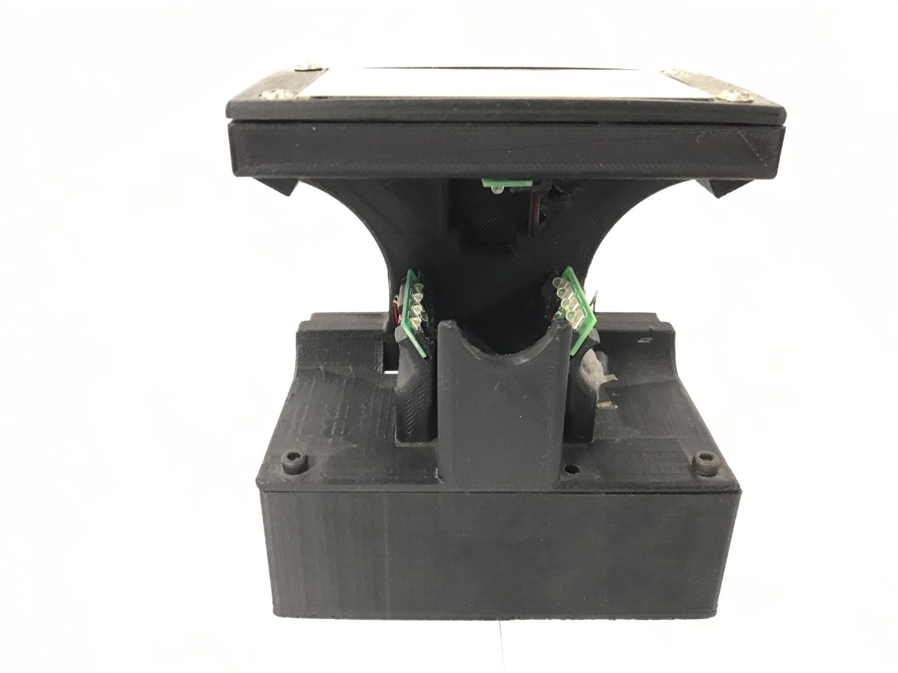
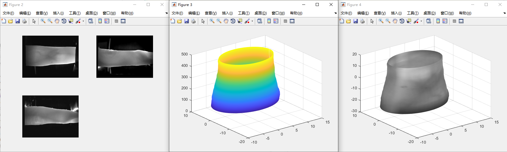
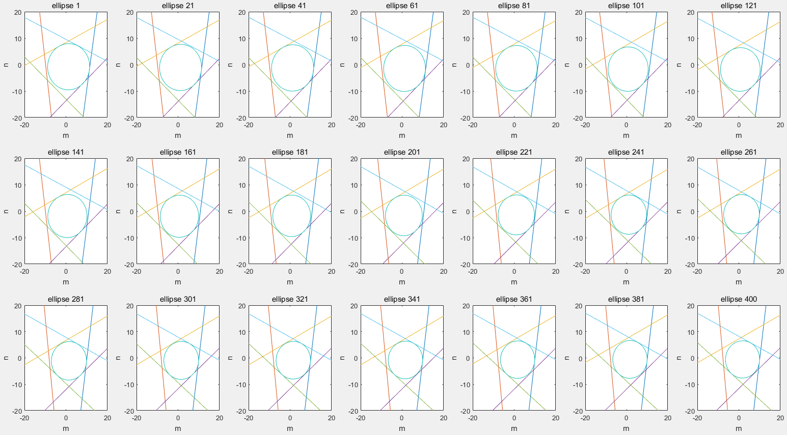

# Code for 3D Finger Vein Reconstruction

Here we provide the description of the demo for reconstructing 3D models from the given images.

## Guidance for the demo

### Preparing data

We have already put 5 examples in the folder `examples`.

In default, you can set `folder = './examples/';` in `demo_reconstruct_one_finger.m`.

If you download the provided whole version of our dataset, you should change the corresponding code in `demo_reconstruct_one_finger.m` into your customized path of the downloaded dataset.

### Camera Parameters

Since our device has three cameras as presented in the following figure, it is necessary to provide accurate intrinsic and extrinsic camera parameters. You can find our calibrated results in `reconstruction/set_cam_params.m`.



### Running 

The sample name is determined by its sample id and capture-time id.

Select an appropriate set of these parameters:

```matlab
% sample id
sub = 1;  % subject id
t = 1;  % time id
```

Then run the code `demo_reconstruct_one_finger.m`, and the code will automatically reconstruct the selected sample into a 3D model.



### Debugging

If the 3D reconstruction fails and require further debugging, we provide an interface to visualize the process during solving the optimal problem in 3D reconstruction.

You can simply change the corresponding code in `demo_reconstruct_one_finger.m`:

```matlab
global en_show;  % visualize the procedure of 3D reconstruction for debugging
en_show = 1;  % 1 - enable the visualization; 0 - disable the visualization.
```

Each of the reconstructed ellipse are visualized in the figure. The optimal problem has converged well if the ellipse is tangent to 6 constraint lines based on epipolar geometry.



